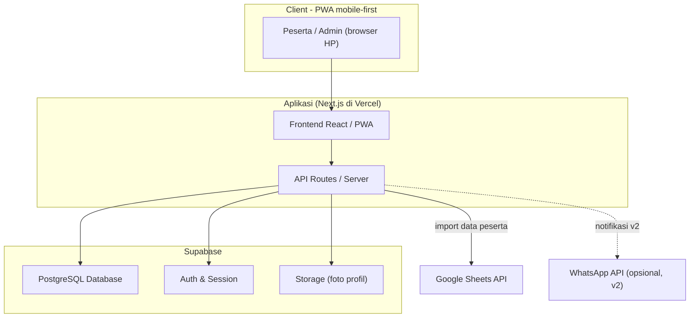
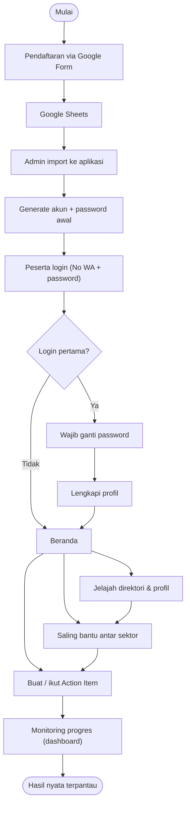
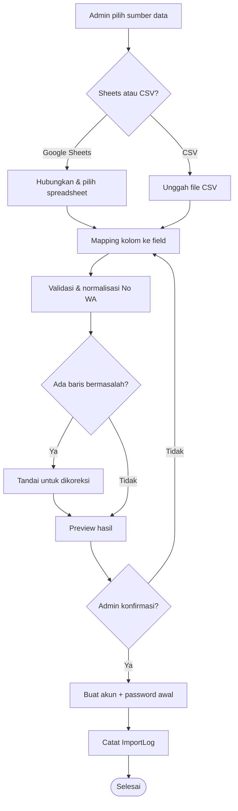
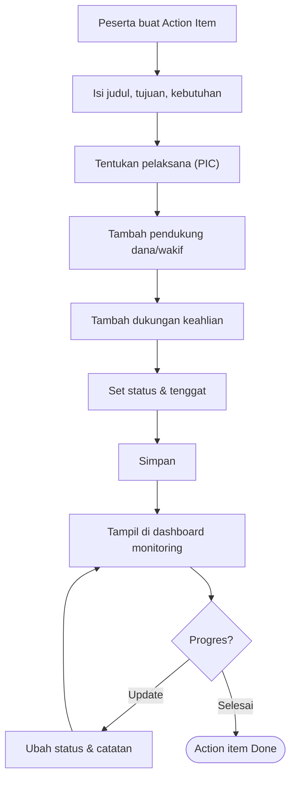
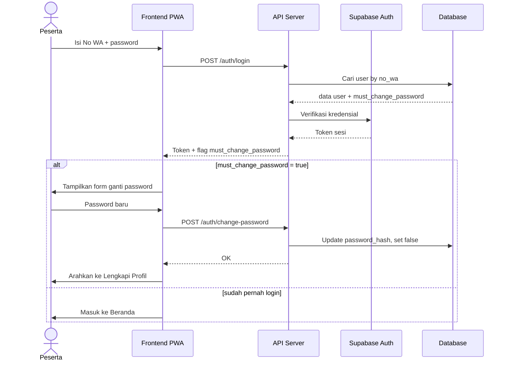
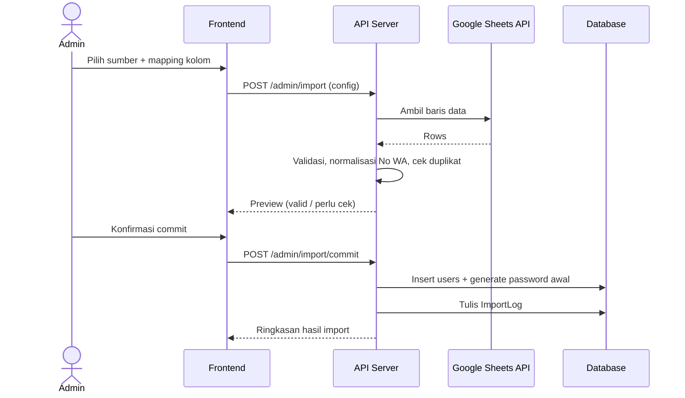
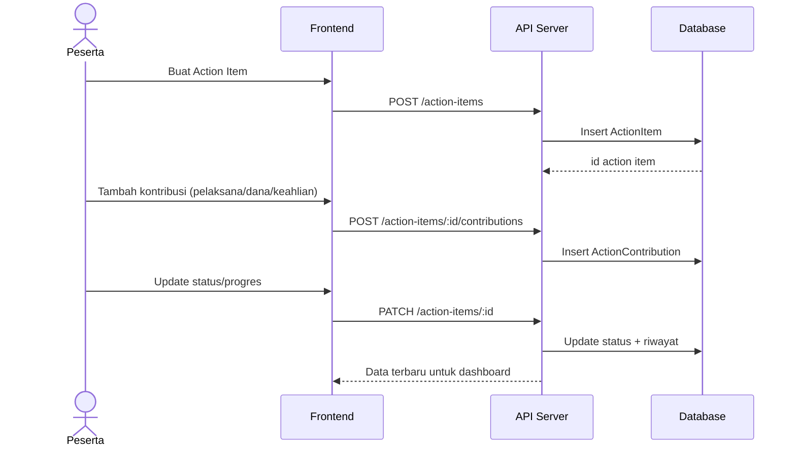
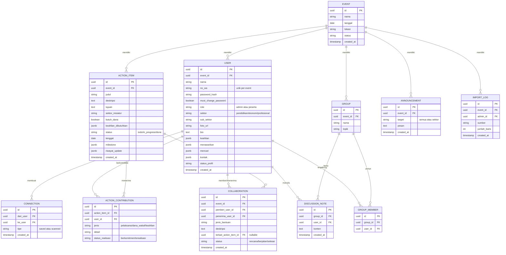

# PRD — Aplikasi Pendukung FGD (Focus Group Discussion)

**Nama kerja produk:** *SinergiFGD* (placeholder, bisa diganti)
**Versi dokumen:** 0.5 (build-ready — arsitektur, diagram, skema DB, wireframe)
**Penyusun:** Product Engineering
**Status:** Draft lanjutan — tersisa beberapa keputusan minor (lihat Bagian 12)

---

## 1. Ringkasan (Overview)

Aplikasi web (mobile-first / PWA) untuk mendukung acara FGD yang mempertemukan **3 sektor** peserta — **Pendidikan**, **Ekonomi**, dan **Profesional** — agar mereka saling mengenal lewat profil, **saling membantu antar sektor**, berkolaborasi, dan menghasilkan **action item / proyek nyata** yang dijalankan bersama dan dapat dimonitor setelah acara.

Alur inti:

> Pendaftaran via Google Form → data masuk Google Sheets → **admin import ke aplikasi** → peserta **login (No. WhatsApp + password)** → **wajib ganti password & lengkapi profil** → **saling mengenal lewat profil** → **saling membantu & berkolaborasi lintas sektor** → **membuat action item dengan kontribusi tiap sektor** → **monitoring progres pasca-FGD**.

---

## 2. Model Kolaborasi 3 Sektor (inti dari "hasil nyata")

Setiap action item adalah proyek bersama. Tiap sektor punya peran berbeda:

| Sektor | Peran dalam proyek | Contoh (proyek "Peningkatan Kualitas Guru") |
|---|---|---|
| **Pendidikan** | **Pelaksana / pemilik domain** — merancang & menjalankan | Mencari cara melatih guru & menyosialisasikan ke sekolah |
| **Ekonomi** | **Penyumbang / wakif** — mendukung pendanaan (wakaf/donasi) | Menyumbang/berwakaf agar pelatihan terwujud |
| **Profesional** | **Pendukung keahlian** — legal, akuntansi, IT, dll. | Mendukung legalitas, pengelolaan keuangan, sistem, dsb. |

### Antar sektor juga saling membantu (siklus saling menguatkan)

Kolaborasi tidak hanya mengalir dari sektor → action item, tetapi juga **antar sektor**, sehingga terbentuk siklus yang saling menguatkan. Contoh nyata:

> Sektor **Profesional** (mis. konsultan keuangan/legal/IT) membantu sektor **Ekonomi** meningkatkan revenue bisnisnya → ekonomi yang revenue-nya naik kemudian dapat **berwakaf/menyumbang lebih besar** ke action item bersama → proyek (mis. peningkatan kualitas guru) makin mungkin terwujud.

Karena itu aplikasi perlu mencatat **dua jenis kolaborasi**:
1. **Kontribusi ke action item** (sektor → proyek bersama) — lihat F7.
2. **Bantuan bilateral antar peserta/sektor** (peserta ↔ peserta) — lihat F7B.

---

## 3. Tujuan & Sasaran

### 3.1 Tujuan
- Acara berjalan lancar tanpa kendala operasional.
- Semua peserta (50–60 orang) bisa saling mengenal lewat profil.
- Antar sektor saling membantu & berkolaborasi.
- Menghasilkan action item nyata yang terukur & termonitor pasca-acara.

### 3.2 Sasaran produk (measurable)
| Metrik | Target |
|---|---|
| Peserta login & lengkapi profil | ≥ 90% |
| Peserta melihat profil peserta lain | ≥ 80% |
| Kolaborasi bilateral antar sektor tercatat | sesuai target panitia |
| Action item lintas sektor terbentuk | sesuai target panitia |
| Action item punya pelaksana, pendukung dana, & dukungan keahlian | 100% |
| Action item berstatus progress/selesai 30 hari pasca-FGD | ≥ 50% |

---

## 4. Keputusan yang Sudah Dikonfirmasi

- **Jumlah peserta:** 50–60 orang (skala kecil → arsitektur sederhana sudah cukup).
- **Cara saling mengenal:** lewat **direktori profil** yang bisa dilihat semua peserta.
- **Hasil nyata:** **action item / proyek kolaborasi lintas sektor** (Bagian 2).
- **Pendanaan:** dicatat sebagai **daftar pendukung/wakif (nama peserta), tanpa nominal rupiah**. Status cukup: berkomitmen / sudah direalisasi.
- **Antar sektor saling membantu:** dicatat sebagai kolaborasi bilateral (F7B).
- **Login pertama:** pengguna **wajib mengganti password** lebih dulu, lalu lengkapi profil.
- **Multi-event:** acara kemungkinan berulang → **struktur data sejak awal mendukung banyak event**, tetapi UI pengelolaan multi-event tidak dibangun dulu (cukup 1 event aktif untuk acara ini).
- **Peran:** hanya **Admin** & **Peserta** — tidak ada fasilitator/moderator untuk saat ini.
- **Target rilis:** **20 Juli 2026** (aplikasi siap & teruji sebelum hari-H).

### Asumsi yang masih perlu konfirmasi
- **Platform:** Web mobile-first / PWA. Bukan native app.
- **Tim pengembang:** diasumsikan 1–2 developer (memengaruhi cakupan realistis — lihat Bagian 13).
- **Bahasa:** Indonesia.

---

## 5. Alur Pengguna (User Journey)

### 5.1 Admin
1. Login admin → buat/pilih Event FGD.
2. Import data peserta dari Google Sheets (F1).
3. Mapping kolom → validasi → preview → commit.
4. Sistem generate akun + password awal tiap peserta.
5. (Opsional) broadcast info login ke peserta.
6. Atur sesi & topik kolaborasi.
7. Pantau engagement, kolaborasi, & action item lewat dashboard.

### 5.2 Peserta
1. Buka link → **Login**: No. WhatsApp + password (4 huruf awal nama + 4 digit akhir No. WA).
2. **Login pertama → wajib ganti password**, lalu **lengkapi profil**.
3. **Jelajah direktori peserta**: filter per sektor, cari, lihat profil lengkap.
4. **Networking & saling bantu**: simpan/koneksi, scan QR, catat bantuan bilateral (mis. profesional bantu ekonomi).
5. **Kolaborasi**: gabung grup lintas sektor, diskusi, catat ide.
6. **Buat / ikut Action Item**: tentukan pelaksana, pendukung dana/wakif, dukungan keahlian, tenggat.
7. **Pasca-FGD**: update progres, lihat dashboard.

---

## 6. Daftar Fitur Lengkap

**[MVP]** = wajib untuk acara; **[v2]** = lanjutan.

### F1 — Import Data dari Google Sheets **[MVP]**
- F1.1 Koneksi via **Google Sheets API** (pilih spreadsheet & tab) **atau** **upload CSV** (fallback).
- F1.2 **Column mapping**: Nama, No. WA, Sektor, dll. → field aplikasi.
- F1.3 **Validasi & pembersihan**: normalisasi No. WA (+62), deteksi duplikat (kunci unik = No. WA), tandai baris bermasalah.
- F1.4 **Preview** valid/invalid sebelum commit.
- F1.5 **Generate kredensial otomatis** (4 huruf awal nama + 4 digit akhir WA).
- F1.6 **Re-sync** untuk pendaftar baru tanpa menggandakan data.
- F1.7 Log import untuk audit.

### F2 — Autentikasi & Akun **[MVP]**
- F2.1 Login **No. WhatsApp + password**.
- F2.2 Password awal: 4 huruf pertama nama + 4 digit terakhir No. WA.
- F2.3 **Login pertama → WAJIB ganti password**, lalu diarahkan melengkapi profil (F3).
- F2.4 Lupa password: reset via admin (paling praktis untuk 50–60 orang) — OTP WhatsApp di v2.
- F2.5 Sesi login persisten selama acara.
- F2.6 Peran: Admin vs Peserta.

### F3 — Profil & Onboarding Peserta **[MVP]**
- F3.1 Tampilkan data dari Sheets (bisa dikoreksi peserta).
- F3.2 Lengkapi data tambahan: foto, sub-sektor/peran (mis. Profesional → IT/Legal/Akuntan), keahlian (tags), bio singkat, **"Saya bisa membantu dengan…"**, **"Saya sedang mencari…"**, kontak yang boleh ditampilkan + kontrol privasi.
  - *Field "bisa membantu / sedang mencari" ini kunci untuk mempertemukan antar sektor (mis. ekonomi mencari bantuan IT/legal → ketemu profesional).*
- F3.3 Indikator kelengkapan profil (progress %).
- F3.4 Validasi field wajib/opsional.

### F4 — Direktori & Networking **[MVP]**
- F4.1 **Daftar peserta** berupa kartu profil (semua bisa dilihat semua).
- F4.2 **Filter per sektor** + sub-sektor.
- F4.3 **Pencarian** by nama, keahlian, kebutuhan.
- F4.4 **Detail profil** lengkap.
- F4.5 **Simpan/Koneksi** ("kontak saya").
- F4.6 **QR Code per peserta** + scanner untuk tukar kontak saat bertemu.
- F4.7 (Opsional) tombol "Chat via WhatsApp" jika peserta mengizinkan.

### F5 — Matchmaking & Saling-Bantu Antar Sektor **[MVP ringan / v2]**
- F5.1 **Rekomendasi koneksi**: cocokkan *"saya mencari"* satu orang dengan *"saya bisa bantu"* orang lain, **prioritas lintas sektor** (mis. ekonomi butuh bantuan keuangan ↔ profesional akuntan).
- F5.2 **Tantangan ice-breaker**: mis. "kenalan dengan ≥1 orang tiap sektor".
- F5.3 (v2) gamifikasi/leaderboard.

### F6 — Kolaborasi & Diskusi **[MVP inti]**
- F6.1 **Grup lintas sektor**: sistem dapat menyarankan komposisi yang mengandung ketiga sektor.
- F6.2 **Ruang diskusi per grup/topik**: papan ide, komentar, catatan.
- F6.3 **Topik/sesi FGD** yang didefinisikan admin.
- F6.4 **Catatan hasil diskusi** bisa langsung dikonversi menjadi Action Item (F7) atau Kolaborasi Bilateral (F7B).

### F7 — Action Item / Proyek Bersama & Monitoring **[MVP inti — "hasil nyata"]**

Satu Action Item = satu proyek bersama dengan kontribusi tiap sektor.

- F7.1 **Buat Action Item / Proyek**: judul, deskripsi, tujuan/output, sektor inisiator, topik.
- F7.2 **Kebutuhan proyek**: dukungan dana (ya/tidak), keahlian yang dibutuhkan (tags), pelaksana/SDM.
- F7.3 **Kontribusi tiap sektor**:
  - **Pelaksana (Pendidikan/domain):** PIC + anggota pelaksana.
  - **Pendukung dana / wakif:** **daftar nama peserta** yang berkomitmen menyumbang/berwakaf — *tanpa nominal*. Status: berkomitmen / sudah direalisasi.
  - **Dukungan keahlian (Profesional):** siapa + peran (mis. "menangani legalitas").
- F7.4 **Status** (kanban): To Do → In Progress → Done + milestone & tenggat.
- F7.5 **Update progres**: PIC/anggota memperbarui status & catatan; riwayat tersimpan.
- F7.6 **Dashboard monitoring**:
  - Per proyek: jumlah pendukung dana (berkomitmen vs terealisasi), apakah dukungan keahlian terpenuhi, status, tenggat.
  - Lintas proyek: jumlah proyek aktif, tingkat keterlibatan tiap sektor.
- F7.7 **Pengingat tenggat** (notifikasi — F9).
- F7.8 **Export laporan** (PDF/CSV) untuk panitia.

> **Catatan pendanaan:** aplikasi hanya mencatat **siapa yang mendukung/berwakaf** & status realisasinya (ditandai manual). Penyaluran dana sebenarnya dilakukan **di luar aplikasi** lewat kanal resmi (rekening yayasan/panitia, dsb.) demi keamanan & legalitas. Aplikasi tidak memproses uang.

### F7B — Kolaborasi & Bantuan Antar-Sektor (Bilateral) **[MVP]**

Mencatat siklus "saling membantu" antar peserta/sektor — bukan hanya kontribusi ke action item.

- F7B.1 **Buat catatan bantuan**: pemberi → penerima (mis. Profesional → Ekonomi), jenis bantuan (konsultasi bisnis, legal, akuntansi, IT, pemasaran, dll.), deskripsi singkat.
- F7B.2 **Status**: rencana → berjalan → selesai.
- F7B.3 **Tautkan ke dampak** (opsional): mis. bantuan ini ditujukan agar penerima dapat berkontribusi ke action item tertentu (menggambarkan siklus revenue → wakaf).
- F7B.4 **Tampil di dashboard** sebagai "jaringan kolaborasi antar sektor" — siapa membantu siapa.
- F7B.5 Bisa muncul otomatis sebagai saran dari matchmaking (F5.1).

### F8 — Dashboard & Panel Admin **[MVP]**
- F8.1 Kelola Event, peserta, sektor, sesi/topik.
- F8.2 Statistik real-time: login, kelengkapan profil, koneksi, kolaborasi bilateral, action item.
- F8.3 Kelola/koreksi data peserta manual.
- F8.4 **Broadcast/pengumuman** ke semua / per sektor.
- F8.5 **Reset password peserta** & bantu yang kesulitan login (krusial hari-H).
- F8.6 Ekspor data & laporan.

### F9 — Notifikasi **[MVP ringan / v2]**
- F9.1 **In-app notification** (pengumuman, undangan grup, pengingat tenggat).
- F9.2 (v2) **WhatsApp notification** via WhatsApp Business API.
- F9.3 (Opsional) email cadangan.

### F10 — Pendukung Operasional Hari-H **[MVP]**
- F10.1 Halaman bantuan/FAQ login.
- F10.2 Mode admin "bantu peserta" (cari, reset, lihat status).
- F10.3 Halaman info acara (rundown, lokasi, kontak panitia).
- F10.4 Uji beban ringan agar tetap lancar saat ~60 orang login bersamaan.

---

## 7. Catatan Teknis & Rekomendasi

### 7.1 Rekomendasi stack (skala 50–60, cepat & murah)
- **Frontend:** Next.js / React (PWA, mobile-first).
- **Backend & DB:** Supabase atau Firebase (auth, database, realtime, hosting cepat).
- **Import Sheets:** Google Sheets API (OAuth) + opsi upload CSV.
- **Hosting:** Vercel / serverless.
- **Notifikasi WA (opsional, v2):** WhatsApp Business API via penyedia.

### 7.2 Catatan keamanan & privasi
1. **Login pertama wajib ganti password** — menutup celah utama dari password awal yang mudah ditebak.
2. **Data pribadi (PII):** No. WA & data peserta. Perlu persetujuan tampil di direktori + kontrol privasi per-field (F3.2).
3. **Pendanaan tidak diproses di aplikasi** (lihat F7) — hanya mencatat pendukung & status realisasi.
4. **Akses admin** dibatasi & ber-log.

---

## 8. Model Data (ringkas)

- **Event**: id, nama, tanggal, lokasi, status.
- **User**: id, event_id, nama, no_wa (unik), password_hash, must_change_password (bool), role, sektor, sub_sektor, foto, bio, keahlian[], menawarkan[], mencari[], kontak{}, status_profil.
- **Connection**: id, dari_user, ke_user, tipe (saved/scanned), waktu.
- **Group**: id, event_id, nama, topik, anggota[].
- **Discussion/Note**: id, group_id, user_id, konten, waktu.
- **ActionItem**: id, event_id, judul, deskripsi, tujuan, sektor_inisiator, butuh_dana (bool), keahlian_dibutuhkan[], status, tenggat, milestone[], riwayat_update[].
- **ActionContribution**: id, action_item_id, user_id, jenis (pelaksana | dana_wakaf | keahlian), peran/detail, status_realisasi. *(jenis dana_wakaf = nama pendukung saja, tanpa nominal)*
- **Collaboration** (bilateral antar peserta): id, event_id, pemberi_user_id, penerima_user_id, jenis_bantuan, deskripsi, terkait_action_item_id (opsional), status.
- **Announcement**: id, event_id, target, pesan, waktu.
- **ImportLog**: id, event_id, admin_id, sumber, jumlah_baris, waktu.

---

## 9. Roadmap / Fase

**Fase 1 — MVP untuk acara:**
F1 Import, F2 Login (+ wajib ganti password), F3 Profil, F4 Direktori & QR, F6 Kolaborasi, F7 Action Item + F7B Kolaborasi bilateral + dashboard, F8 Admin, F10 Operasional, F5.1 rekomendasi sederhana, F9.1 notif in-app.

**Fase 2:**
F5 matchmaking lanjutan + gamifikasi, F9.2 notifikasi WhatsApp, analitik lebih kaya, OTP login, dukungan multi-event.

---

## 10. Risiko & Mitigasi

| Risiko | Dampak | Mitigasi |
|---|---|---|
| Data Sheets tidak rapi | Import gagal/duplikat | Normalisasi & preview validasi (F1.3–F1.4) |
| Peserta gaptek sulit login | Engagement turun | Ganti password dibuat sederhana + mode admin bantu (F10) |
| Komitmen dana/bantuan tidak terealisasi | Proyek mandek | Tandai status realisasi + pengingat + dashboard transparan |
| Action item mandek pasca-acara | Tidak ada hasil nyata | PIC jelas + tenggat + monitoring |
| Salah paham soal dana di aplikasi | Risiko hukum/kepercayaan | Aplikasi hanya catat pendukung, transfer di luar aplikasi (F7) |

---

## 11. Definition of Done (MVP)
- Admin import dari Sheets tanpa error & generate akun.
- Peserta login, wajib ganti password, lengkapi profil, jelajah direktori dari HP.
- Peserta saling terhubung & dapat mencatat bantuan antar sektor.
- Action Item dengan pelaksana + pendukung dana + dukungan keahlian dapat dibuat, diperbarui, dan dimonitor.
- Admin memantau & mengekspor laporan.

---

## 12. Keputusan Minor yang Tersisa

1. **Field profil tambahan:** apakah usulan di F3.2 cukup, atau ada data spesifik lain yang ingin dikumpulkan?
2. **Notifikasi WhatsApp** dibutuhkan sejak awal, atau cukup in-app dulu (WA di Fase 2)? *(Rekomendasi: in-app dulu, mengingat target 20 Juli yang ketat.)*
3. **Tim pengembang:** apakah sudah ada developer/tim, atau perlu opsi low-code? (Menentukan apakah scope MVP perlu dipangkas lagi.)

---

## 13. Timeline & Rencana Eksekusi menuju 20 Juli 2026

Dari ± 30 Juni ke 20 Juli ≈ **3 minggu**. Ini **agresif** untuk seluruh fitur, jadi scope dikunci ke "MVP hari-H" dan sisanya menjadi fast-follow setelah acara (banyak fitur monitoring memang baru dipakai pasca-FGD).

### 13.1 Scope MVP yang DIKUNCI untuk 20 Juli
Wajib siap & teruji sebelum hari-H:
- F1 Import Google Sheets + generate akun
- F2 Login + wajib ganti password
- F3 Profil & onboarding
- F4 Direktori + filter + lihat profil (+ QR jika sempat)
- F7 Buat & kelola Action Item (pelaksana, pendukung dana/wakif, dukungan keahlian, status)
- F7B Catat kolaborasi/bantuan antar sektor
- F8 Admin inti (kelola peserta, reset password, broadcast)
- F9.1 Notifikasi in-app dasar
- F10 Pendukung operasional hari-H

### 13.2 Fast-follow (boleh menyusul, beberapa hari–minggu setelah acara)
- F5 Matchmaking lanjutan & gamifikasi
- F6 Ruang diskusi penuh (saat acara cukup: catatan + action item)
- F7.6 Dashboard monitoring versi kaya (action item tetap diupdate s/d 30 hari pasca-acara)
- F9.2 Notifikasi WhatsApp
- UI pengelolaan multi-event

### 13.3 Linimasa (mundur dari 20 Juli; asumsi 1–2 developer)
| Periode | Fokus |
|---|---|
| **30 Jun – 4 Jul** | Setup proyek, skema DB (multi-event ready), auth, desain sistem, kerangka import |
| **5 Jul – 11 Jul** | Profil, direktori + filter + QR, admin inti, reset password |
| **12 Jul – 16 Jul** | Action item (F7), kolaborasi bilateral (F7B), dashboard dasar, broadcast, notif in-app |
| **17 Jul – 19 Jul** | **Uji coba + dry-run import data nyata + uji ~60 login bersamaan + perbaikan bug + deploy** |
| **20 Jul** | **Hari-H** — admin standby membantu peserta login |
| Setelah 20 Jul | Fast-follow (13.2) |

### 13.4 Catatan penting agar 20 Juli tercapai
- **Tutup pendaftaran Google Form** beberapa hari sebelum acara (idealnya ≤ 16 Juli) agar data final bisa di-import & diuji.
- **Sediakan satu set data uji** lebih awal supaya fitur import bisa divalidasi tanpa menunggu data asli.
- Jika ternyata **belum ada developer**, scope perlu dipangkas lagi (mis. tunda F7B & QR) atau pertimbangkan pendekatan low-code.

---

## 14. Arsitektur Sistem

### 14.1 Diagram arsitektur



### 14.2 Komponen utama
- **Frontend (PWA):** mobile-first, bisa "Add to Home Screen", offline-tolerant ringan (cache aset).
- **API/Server:** validasi, logika import, autentikasi, aturan akses peran.
- **Database (PostgreSQL via Supabase):** semua data event, peserta, action item, kolaborasi.
- **Auth:** sesi login + flag `must_change_password`.
- **Storage:** foto profil.
- **Integrasi:** Google Sheets API (import); WhatsApp API menyusul di v2.
- **Akses (Row-Level Security):** peserta hanya melihat data event-nya; aksi tulis dibatasi pemilik/PIC; admin akses penuh dalam event-nya.

### 14.3 Daftar endpoint API (indikatif)
| Method & Path | Fungsi | Peran |
|---|---|---|
| `POST /auth/login` | Login (No WA + password) | Publik |
| `POST /auth/change-password` | Ganti password (login pertama) | Peserta |
| `GET /me` / `PATCH /me` | Lihat / lengkapi profil | Peserta |
| `GET /participants` | Direktori + filter sektor/pencarian | Peserta |
| `GET /participants/:id` | Detail profil | Peserta |
| `POST /connections` | Simpan/scan koneksi | Peserta |
| `GET/POST /action-items` | Daftar / buat action item | Peserta |
| `PATCH /action-items/:id` | Update status/progres | PIC/anggota |
| `POST /action-items/:id/contributions` | Tambah kontribusi (pelaksana/dana/keahlian) | Peserta |
| `GET/POST /collaborations` | Kolaborasi bilateral antar sektor | Peserta |
| `POST /admin/import` / `/import/commit` | Import dari Sheets/CSV | Admin |
| `POST /admin/participants/:id/reset-password` | Reset password peserta | Admin |
| `POST /admin/announcements` | Broadcast pengumuman | Admin |
| `GET /admin/dashboard` | Statistik & monitoring | Admin |

---

## 15. Flowchart Alur Utama

### 15.1 Alur menyeluruh (end-to-end)



### 15.2 Alur import data (admin)



### 15.3 Alur Action Item



---

## 16. Sequence Diagram

### 16.1 Login & ganti password (login pertama)



### 16.2 Import data dari Google Sheets



### 16.3 Membuat Action Item dengan kontribusi



---

## 17. Skema Database (ERD)



**Catatan skema:**
- Semua tabel berisi `event_id` agar siap multi-event (filter per event).
- `no_wa` unik **per event** (kunci untuk dedup saat import & login).
- `keahlian`, `menawarkan`, `mencari`, `keahlian_dibutuhkan`, `milestone`, `riwayat_update` disimpan sebagai `jsonb` (fleksibel, mudah berkembang). Jika butuh query berat, tags dapat dipindah ke tabel terpisah.
- `dana_wakaf` di `ACTION_CONTRIBUTION` hanya menyimpan **siapa** + status realisasi, **tanpa nominal**.
- `COLLABORATION` merekam bantuan bilateral antar peserta (siklus saling-bantu), opsional ditautkan ke action item.

---

## 18. Wireframe Layar Utama (lo-fi)

Wireframe mobile (struktur layout, bukan desain final). Render visual juga ditampilkan terpisah.

### 18.1 Login
```
┌─────────────────────────┐
│        SinergiFGD        │
│   Masuk ke acara FGD     │
│                          │
│  No. WhatsApp            │
│  [ +62…                ] │
│  Password                │
│  [ ••••••••            ] │
│                          │
│  [        Masuk        ] │
│  Butuh bantuan login?    │
└─────────────────────────┘
```

### 18.2 Ganti password (login pertama)
```
┌─────────────────────────┐
│  ← Ganti Password        │
│  Demi keamanan, buat     │
│  password baru.          │
│  Password baru           │
│  [ ••••••••            ] │
│  Ulangi password baru    │
│  [ ••••••••            ] │
│  [   Simpan & lanjut   ] │
└─────────────────────────┘
```

### 18.3 Lengkapi profil
```
┌─────────────────────────┐
│  Lengkapi Profil  ▓▓▓░ 60%│
│  (foto)  [ Unggah foto ] │
│  Sektor                  │
│  (•) Pendidikan          │
│  ( ) Ekonomi           │
│  ( ) Profesional         │
│  Sub-sektor/peran        │
│  [ mis. Guru SD        ] │
│  Keahlian   [+kurikulum] │
│  Saya bisa membantu…     │
│  [                     ] │
│  Saya sedang mencari…    │
│  [                     ] │
│  [        Simpan       ] │
└─────────────────────────┘
```

### 18.4 Direktori peserta
```
┌─────────────────────────┐
│  Direktori Peserta    🔍 │
│ [Semua][Pddk][Pgsh][Prof]│
│  ┌─────────────────────┐ │
│  │ ◯ Budi Santoso      │ │
│  │   Ekonomi · F&B   │ │
│  │   Cari: bantuan IT  │ │
│  └─────────────────────┘ │
│  ┌─────────────────────┐ │
│  │ ◯ Siti Aminah       │ │
│  │   Pendidikan · Guru │ │
│  │   Bantu: pelatihan  │ │
│  └─────────────────────┘ │
│ ─────────────────────────│
│ [Direktori][Aksi][QR][≡] │
└─────────────────────────┘
```

### 18.5 Detail profil peserta
```
┌─────────────────────────┐
│  ←  Profil               │
│         (foto)           │
│       Budi Santoso       │
│     Ekonomi · F&B      │
│  Bisa membantu:          │
│   • Pendanaan / wakaf    │
│  Sedang mencari:         │
│   • Bantuan legal & IT   │
│  [ Simpan ] [ Chat WA ]  │
│  [ Catat bantuan/kolab ] │
└─────────────────────────┘
```

### 18.6 Daftar & detail Action Item
```
┌─────────────────────────┐    ┌─────────────────────────┐
│  Action Items         +  │    │  ←  Action Item          │
│ [To Do][Progress][Done]  │    │  Judul                   │
│  ┌─────────────────────┐ │    │  [ Peningkatan Kualitas]│
│  │ Peningkatan Kualitas│ │    │  Tujuan / output         │
│  │ Guru                │ │    │  [                     ] │
│  │ PIC: Siti · 20 Agu  │ │    │  Butuh dana? (•)Ya ( )Tdk│
│  │ 👤pelaksana ✔       │ │    │  Keahlian [+legal][+akun]│
│  │ 💰wakif: 3 orang    │ │    │  ── Kontribusi ──        │
│  │ 🛠keahlian: legal   │ │    │  Pelaksana (PIC): [ ▼ ]  │
│  │ [ In Progress ]     │ │    │  Dana/wakif: [+ peserta] │
│  └─────────────────────┘ │    │  Keahlian:   [+ peserta] │
│                          │    │  Status:[ToDo▼] Tgl:[__] │
│                          │    │  [        Simpan       ] │
└─────────────────────────┘    └─────────────────────────┘
```

### 18.7 Admin — dashboard & import
```
┌──────────────────────────────────┐   ┌──────────────────────────────────┐
│  Admin · SinergiFGD      [Event ▼] │   │  ← Import Data Peserta             │
│ [58 peserta][52 login][14 aksi]   │   │  Sumber: (•)Google Sheets ( )CSV   │
│ [9 kolaborasi]                    │   │  Spreadsheet: [ pilih…        ▼ ]  │
│  Action item per status           │   │  ── Mapping kolom ──               │
│  ▓▓▓ ToDo  ▓▓ Progress  ▓ Done    │   │  Nama         → [ Kolom A ▼ ]      │
│  Keterlibatan sektor              │   │  No. WhatsApp → [ Kolom B ▼ ]      │
│  Pddk ▓▓▓▓  Pgsh ▓▓▓  Prof ▓▓▓▓▓  │   │  Sektor       → [ Kolom C ▼ ]      │
│ ──────────────────────────────────│   │  [ Preview ]  58 valid · 2 cek     │
│ [Import][Peserta][Broadcast][Lap.]│   │  [ Konfirmasi & buat akun ]        │
└──────────────────────────────────┘   └──────────────────────────────────┘
```

---

*PRD ini sudah build-ready: scope MVP terkunci, arsitektur, alur, skema data, dan layout tersedia. Langkah berikutnya yang bisa saya bantu: prototipe layar interaktif, atau backlog teknis (breakdown tugas per sprint sesuai Bagian 13).*
